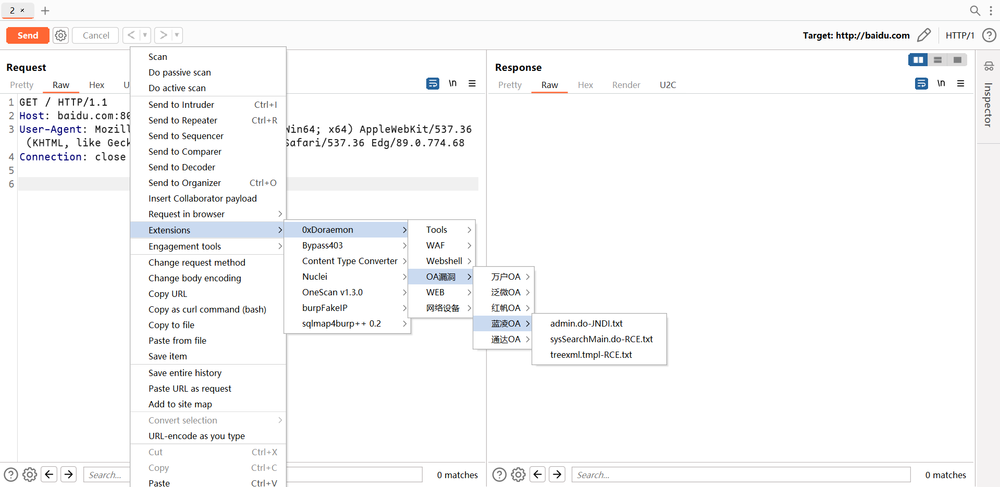
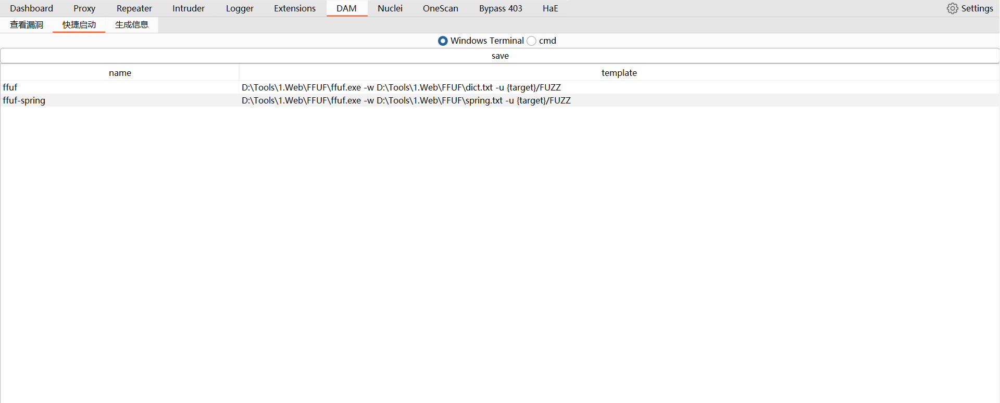

## Doraemon-渗透辅助小工具

### 前言

1. 在渗透测试或挖 SRC 的时候每次都需要在笔记中复制一些 Payload 或 Webshell 内容觉得太麻烦了，所以打算 **抄一个** Burpsuite 插件，直接在 Burpsuite 点一点操作就简单多了。
2. 在复现一些Http 请求的漏洞，每次都需要在笔记复制exp或写个简单的 python 脚本觉得太麻烦了，如果在 Burpsuite 中直接修改请求包就简单多了。
3. 每次都需要到其他目录打开一些工具，直接在BurpSuite 打开其他工具进行目录扫描等操作就简单多了


### 使用

下载压缩包，修改DAM目录下的目录或文件

- Exp 目录（不能修改目录名）是漏洞相关的，会**修改整个数据包**
- Payload 目录（不能修改目录名），把 **Payload 插入到数据包中**
- `{{Host}}`  或 `{{Hostname}}` 自动获取相关的 Host
- `{{Cookie}}`  获取Cookie
- `{{url}}` 获取URL
- 在 exp 数据包开头可以使用 `/* 来注释内容 */` 


目录架构：可以在Exp或Payload目录下随意新建目录或文件。

```
├─Exp
│  ├─OA漏洞
│  │  ├─OA
│  │  │   漏洞1.txt
│  │  ├─OA2
│  │  │   漏洞2.txt
└─Payload
    └─Webshell
        ├─哥斯拉
        │      jsp.txt
        ├─冰蝎
        │      jsp.txt
```

漏洞1：把漏洞的数据包保存为文件，修改相关的 Host ,Cookie。

```http
/*
内存马：xxxxx
请求头：xxxxx
*/
GET / HTTP/1.1
Host: {{Host}}
User-Agent: Mozilla/5.0 (Windows NT 10.0; Win64; x64) AppleWebKit/537.36 (KHTML, like Gecko) Chrome/89.0.4389.114 Safari/537.36 Edg/89.0.774.68
Cookie: {{Cookie}}
Connection: close


```




注释的内容直接显示


#### tools.yaml

可以直接在GUI直接新增和删除，也可以手动添加

```
Tools:
- [test, '{request}']
- [test2, '{url}']
- [test3, '{host}']
- [test4, '{domain}']
- [test5, '{target}']

```

**配置**

https://www.baidu.com/index.php

- {request} 表示使用请求包
- {url} : https://www.baidu.com/index.php
- {host} : www.baidu.com
- {domain} :  baidu.com
- {target} :  https://www.baidu.com





### 参考

本工具基于大量优秀文章和工具才得以~~编写~~ 抄写完成，非常感谢这些无私的分享者！

- https://github.com/bit4woo/burp-api-drops
- https://github.com/bit4woo/knife
- https://github.com/d3vilbug/HackBar

- https://github.com/kN6jq/gather

